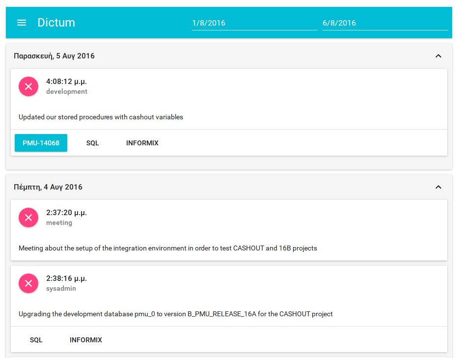

# dictum



I created this project in order to visualize the data that I keep for my day-to-day activities at work and make myself familiar with [React](https://facebook.github.io/react/). For the ui I used [material-ui](http://www.material-ui.com/).

Having a record of the tasks that I do daily saves me a lot of time from a variety of managerial responsibilities:
- Completing the self-assessment part of the yearly appraisal process.
- Filling in expense forms at the end of each month.

It's also a place for me to keep technical notes, which took me a lot of time to figure out, but are not something that you do daily to memorize. Having notes helps dig up a certain oneliner command easily, without the need to use google for one hour.

I keep my notes in a couchdb instance that I run locally, because it has very good replication and also runs perfectly with pouchdb. In order to capture a task doc, I have become accustomed to using the command line, so I use a small nodejs wrapper included in this repository, [here](./tools/client.js).

A dictum doc expects to have some specific attributes. Here is the json representation of the first activity rendered in the screenshot:

```
{
   "_id": "2016-08-05T13:08:12.155Z",
   "_rev": "1-c0b645435108ee385fd150a008b23f1f",
   "type": "development",
   "lang": [
       "sql",
       "informix"
   ],
   "ticket": "PMU-14068",
   "desc": "Updated our stored procedures with cashout variables"
}
```

and this is the client.js call that created the above:

```
./client.js --type development --lang "sql,informix" --ticket PMU-14068 --desc "Updated our stored procedures with cashout variables"
```

- _id: This is automatically generated based on the timestamp at the time that the task was captured. Basically it's a `new Date().toJSON()`; I usually have 3-4 entries per day, which makes the timestamp good enough for a primary key.
- _rev: Automatically generated by pouchdb/couchdb.
- type: The type of the task that you did. I'm working as a developer, so I'm usually using "development", "analysis", "meeting" and "sysadmin".
- lang: An array that is automatically created from a comma separated string list by the client. It's supposed to hold the main technologies that were required by the task.
- ticket: Jira ticket identifier. Creates an href and appends the ticket number, so the corresponding jira ticket is easily accessible. The URL can easily be modified to fit your personal needs.
- desc: A small description of what you did.

## Installation

- git clone
- Install couchdb and create a database named "work". If you use a port other than 5984, or you are not running couchdb at localhost, you'll have to change couchdb endpoints in [this](./tools/client.js) and [this](./src/app/Calendar.js) file.
- npm install
- npm run build
- Use build/index.html to visualize the tasks that you have added with the client.js program. I usually create a symlink from my apache's /var/www/html to point to /path/to/dictum/build and access it using localhost/dictum .

## Roadmap

- [ ] Create pie charts that visualize **type** and **lang** statistics.
- [ ] Pressing the clear button of a doc should really delete the doc from the database.
- [ ] Remove a doc from the list if a changes feed with the deleted attribute is received.
- [ ] Remove hardcoding of my personal needs and make the project more configurable (e.g. locale, jira href, couchdb location)
